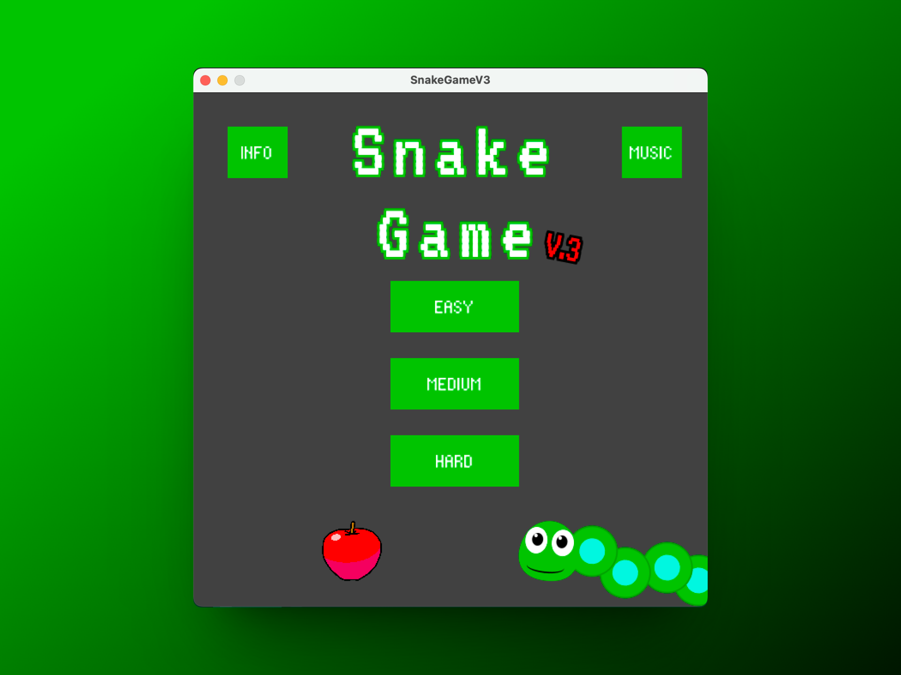

# Snake Game V3

Snake Game V3.
A Java snake game developed in Processing IDE and its API with info page, sound control and difficulty selection.
**Easy:** the classic snake game, don't touch the edges or yourself or you'll die;
**Medium:** a set of wall is placed with random positions at the beginning if the game;
**Hard:** every apple eaten, one wall more on the table, with random position so watch out!
The only thing you need to do is press **Play** and **have fun**!

## Mockup

## Demo

<video src="mockups/SnakeGameV3.mp4" controls></video>

## Hope you Enjoy!
